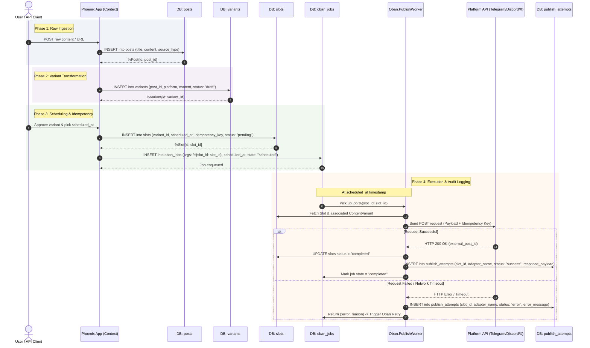

# Social Studio Design

## 1. Problem Statement

Social Studio transforms a blog post into a coordinated social media campaign. A campaign contains platform-specific drafts derived from one source post, a review and approval workflow, optional publication schedules, and a history of publication attempts.

The transformation must be deterministic for the same source content and constraint profile. Publishing must be idempotent: retrying the same approved platform post with the same idempotency key must not create a duplicate publication or duplicate history entry. Each platform post should retain its source campaign, target platform, rendered content, status, and publication metadata.

The initial implementation uses mock platform adapters for development and demonstration. Platform constraints are applied before approval so reviewers see content that is ready for its target platform.

## 2. Constraint Profiles

Each platform profile defines the maximum rendered length, expected tone, and hashtag limit. The transformation pipeline should validate these constraints before a draft can be approved.

| Platform | Max length | Tone | Max hashtags |
| --- | ---: | --- | ---: |
| Telegram | 2,000 characters | Conversational and informative | 5 |
| Discord | 2,000 characters | Conversational, community-oriented, and informative | 5 |
| Mock X (Twitter) | 280 characters | Concise and direct | 2 |
| Mock LinkedIn | 3,000 characters | Professional and insight-oriented | 5 |

Hashtags count toward the platform's maximum length. A draft that exceeds its length or hashtag limit is invalid and cannot be approved until it is regenerated or edited. The profile definitions should be centralized so the same rules are used during generation, validation, and publication.

## 3. API / Core Surface

The core surface is organized around campaigns and their platform posts. JSON request and response shapes may evolve, but every mutating request should return stable resource identifiers and status information.

### Ingestion

- `POST /api/blog-posts` creates or ingests a source blog post.
- `GET /api/campaigns/:id` returns the campaign, source post, platform drafts, statuses, and validation results.

### Review and Approval

- `PATCH /api/campaign-posts/:id` updates editable draft content or metadata while the post is in draft or rejected status.
- `POST /api/campaign-posts/:id/approve` approves a variant for scheduling.
- `POST /api/campaign-posts/:id/reject` rejects a variant with a reason.

Approval is a state transition, not a replacement for validation. The server must revalidate the final content and reject approval when the selected constraint profile is violated.

### Scheduling and Publishing

- `POST /api/campaign-posts/:id/schedule` schedules an approved variant.
- `POST /api/slots/:id/publish` triggers immediate idempotent dispatch for a scheduled slot.

Publishing requests must accept an idempotency key, for example through the `Idempotency-Key` header. The key should be stored with the publication attempt and scoped to the campaign post. A repeated request with the same key returns the original result; a request that reuses the key with different content or target data returns a conflict. Platform adapters should also use their own external publication identifier when available.

### History Queries

- `GET /api/publishing/history` returns the audit trail of publication attempts, including external identifiers, response status, error details, and timestamps.

History is append-only from the API consumer's perspective. Failed retries should be visible without overwriting the original attempt, while an idempotent replay should reference the existing successful result instead of adding a duplicate publication.

## 4. Database and Publishing Workflow



## 5. Explicit Non-Goal

The first version does not include:

- Real Instagram or LinkedIn OAuth integration, account linking, or live production publishing.
- AI image generation or image asset creation.
- Analytics tracking, engagement collection, attribution, or performance dashboards.

The mock adapters and deterministic text transformation provide the foundation for those capabilities later without making them part of the initial delivery scope.

# Flyrank Social Studio - UI & UX Architecture Specification

## 1. UX Principles
* **Speed & Real-time Feedback:** All user actions utilize Phoenix LiveView socket messages (`phx-click`, `phx-submit`) with instant loading spinners and optimistic UI states.
* **Accessible Component Composition:** Built on Petal Components v4 using native semantic HTML tags, WCAG 2.1 compliance, and keyboard navigation support.
* **Consistent Theme System:** Universal support for Light and Dark modes via Tailwind v4 CSS variables (`@theme inline`) toggled at the `<html>` root level.

---

## 2. Directory & LiveView Structure

```text
lib/flyrank_capstone_social_studio_web/
├── components/
│   └── layouts/
│       ├── root.html.heex       # Theme initialization script & HTML wrapper
│       └── app.html.heex        # Global App Shell (Nav Header, Theme Switch, Footer)
└── live/
    ├── content_live/
    │   ├── index.ex             # Ingestion form & recent posts list state
    │   └── index.html.heex      # Petal-powered ingestion dashboard
    ├── post_live/
    │   ├── show.ex              # Single Post & Variant inspector state
    │   └── show.html.heex       # Tabbed platform variant inspection template
    └── analytics_live/
        ├── index.ex             # AI cost & telemetry metrics state
        └── index.html.heex      # Real-time analytics dashboard
```

## 3. User Navigation Flow

### Step 1: Landing & Ingestion (/posts)
User lands on /posts and views the persistent header with system status. User enters a URL or pastes Markdown content, selects target social platforms, and clicks "Ingest & Generate". LiveView sets @loading: true on the primary button, processes the request via Content.ingest_and_generate/1, updates the list optimistically, and displays a success flash notification.

### Step 2: Inspection & Verification (/posts/:id)
User clicks "Inspect Variants →" on any post card. LiveView performs a live_redirect to /posts/:id. User inspects side-by-side: original source vs. platform variants (Telegram, X). User verifies AI grounding status badges and uses one-click copy buttons to pull formatted social copy.

### Step 3: Monitoring & Metrics (/analytics)
User clicks "Analytics" in the navigation header. View displays live stats for accumulated AI cost (total_ai_cost), ingestion throughput, and platform distributions.

## 4. Theme & Accessibility Specifications

- Light Palette: White background (bg-slate-50), Slate cards (bg-white), Blue primary CTA (--color-primary-600).
- Dark Palette: Dark slate background (dark:bg-slate-900), Slate cards (dark:bg-slate-800), High-contrast text (dark:text-slate-100).
- Keyboard Control: All interactive elements (Modals, Dropdowns, Tabs) support Tab, Space, Enter, and Escape standard keyboard interactions.

---

