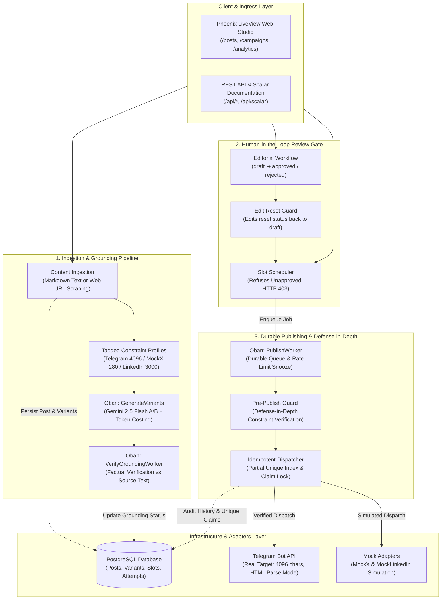

# Social Studio - Multi-Platform Content Ingestion & Publishing Studio

Social Studio is a production-grade **Elixir & Phoenix (LiveView + REST API)** application that ingests long-form blog content (Markdown and web URLs), generates platform-tailored social media drafts (Telegram, Mock X, Mock LinkedIn), enforces strict constraint rules, provides a human-in-the-loop editorial review workflow, and dispatches posts using an idempotent, durable background worker pipeline.

The application serves both:
1. **An Interactive Phoenix LiveView Web Studio:** Real-time content ingestion, A/B variant inspection, interactive grounding audit spinners, editorial approval controls, calendar slot scheduling, and live analytics telemetry.
2. **A Versioned REST API with OpenAPI 3.0 / Scalar Docs:** Programmatic endpoints for ingestion, variant lifecycle transitions, slot scheduling, idempotent dispatching, and audit log querying—documented interactively via Scalar at `/api/scalar`.

---

## Architecture Overview

The system is built on OTP concurrency primitives, PostgreSQL with Ecto, Oban durable background queues, and Phoenix PubSub, organized into clean domain contexts:

- **Content Context (`FlyrankCapstoneSocialStudio.Content`):**
  - Ingests Markdown or scrapes remote web URLs (sanitized with `Floki` and executed outside database transactions to eliminate pool starvation).
  - Enforces domain **Constraint Profiles** (character length caps, hashtag quotas, tone rules, and parse modes like HTML) via typed schemas.
  - Generates A/B candidate variants with Google Gemini 2.5 Flash and computes exact financial cost accounting using `Decimal` arithmetic.
  - Enforces factual grounding audits via `VerifyGroundingWorker` to prevent AI hallucinations.
  - Implements validation (`Variant.validate_platform_constraints/2`) with typed violation tagging.
- **Publishing Context (`FlyrankCapstoneSocialStudio.Publishing`):**
  - **Human-in-the-Loop Review Gate:** Enforces that only variants in `approved` status can be scheduled or dispatched; unapproved attempts are rejected with HTTP 403 Forbidden.
  - **Defense-in-Depth Pre-Publish Guard:** Dispatches pass through a pre-flight constraint verification right before contacting external networks, intercepting out-of-band mutations, rule changes, or UTM decorator expansions without crashing worker queues.
  - **Durable Scheduling & Snooze:** Schedules publication slots backed by Oban. Parses upstream HTTP 429 `Retry-After` headers and snoozes background retries dynamically.
  - **Hardware-Level Idempotency:** Protects slot execution using transactional locks (`SELECT FOR UPDATE`), incoming `Idempotency-Key` headers, and a PostgreSQL partial unique index on `publish_attempts (slot_id) WHERE status = 'success'`.
  - **Pluggable Adapter Seam:** Decoupled `SocialPublisher` behavior resolving adapters dynamically from configuration without touching domain logic. Ships with a real Telegram adapter (enforcing the 4,096 character UTF-8 message ceiling and safe HTML entity parsing) and mock adapters (`MockX`, `MockLinkedIn`).
  - **Immutable Audit History:** Records every publication attempt (success, failure, rate limit) with timestamps, external IDs, and error payloads.
- **Phoenix LiveView UI Layer (`FlyrankCapstoneSocialStudioWeb`):**
  - Reactive single-page studio with real-time PubSub event streaming.
  - Inspector view for variant editing, grounding audits, one-click approvals, and slot scheduling.
  - Live analytics dashboard displaying total AI expenditure, token metrics, and real-time grounding pass rates.



Detailed architectural blueprints, sequence diagrams, failure recovery matrices, and verified test transcripts are available in the documentation guides:

- [Content Ingestion and Factual Grounding Guide](guides/content_ingestion_and_grounding.md)
- [Publishing, Review, Scheduling, and Dispatch Guide](guides/publishing_and_dispatch.md)

---

## Quick Start (Docker)

### Prerequisites

- Docker Desktop with Docker Compose
- Ports `4000` (Web / API) and `5432` (PostgreSQL) available

### Start the Application

From the repository root, build the Phoenix image and start PostgreSQL and the web application:

```bash
docker compose up --build
```

Compose starts the `db` container first, waits for PostgreSQL to become healthy, runs Ecto migrations automatically, and starts the Phoenix server at `http://localhost:4000`.

To start in detached background mode:

```bash
docker compose up --build -d
```

Check status and follow logs:

```bash
docker compose ps
docker compose logs -f web
```

To stop containers while preserving database state:

```bash
docker compose down
```

To reset the database cleanly:

```bash
docker compose down -v
```

Configure `TELEGRAM_BOT_TOKEN` and `TELEGRAM_CHAT_ID` in your `.env` file when publishing to a live Telegram channel.

### Seed Sample Data

Populate the database with a demonstration blog post, platform variants across lifecycle states (`draft`, `approved`, `published`), scheduled slots, and audit logs:

```bash
# Local host execution
mix run priv/repo/seeds.exs

# Inside Docker
docker compose run --rm web /app/bin/server eval "Code.eval_file(\"/app/lib/flyrank_capstone_social_studio-0.1.0/priv/repo/seeds.exs\")"
```

Once seeded:
- **Web Studio UI:** `http://localhost:4000`
- **Publishing History & Audit Logs:** `http://localhost:4000/publishing/history`
- **Campaign Analytics & Telemetry:** `http://localhost:4000/analytics`
- **Interactive OpenAPI 3.0 Documentation:** `http://localhost:4000/api/scalar`

---

## API Endpoints

All REST endpoints support standard JSON payloads and return descriptive error shapes:

| Method | Endpoint | Description |
| --- | --- | --- |
| `POST` | `/api/blog-posts` | Ingests a blog post (Markdown or URL) and creates local draft variants. |
| `PATCH` | `/api/variants/:id` | Updates variant content (resets status to `draft`). |
| `POST` | `/api/variants/:id/approve` | Approves a variant for scheduling. |
| `POST` | `/api/variants/:id/reject` | Rejects a variant with a reason. |
| `POST` | `/api/variants/:id/schedule` | Schedules an approved variant (returns 403 for unapproved). |
| `GET` | `/api/campaigns/:id` | Returns campaign details with variants and slots. |
| `POST` | `/api/slots/:id/publish` | Triggers immediate idempotent dispatch with pre-publish guard. |
| `GET` | `/api/publishing/history` | Returns the immutable audit history of publication attempts. |

Interactive API documentation and schema exploration are accessible via Scalar at `http://localhost:4000/api/scalar`.

---

## Automated Verification & Testing

The application is thoroughly verified using ExUnit:

```bash
# Run the entire test suite
mix test

# Run publishing and dispatch behavior tests
mix test test/flyrank_capstone_social_studio/publishing_test.exs

# Run adapter and Telegram payload tests
mix test test/flyrank_capstone_social_studio/adapter_test.exs

# Run content ingestion and constraint profile tests
mix test test/flyrank_capstone_social_studio/content_test.exs
```

---

## Known Limitations

In accordance with the Capstone Brief requirements:
1. **Target Platforms:** Real publication is implemented for Telegram (via Telegram Bot API) as the free target platform. Platforms without free developer bot tiers (X/Twitter and LinkedIn) use local mock adapters (`MockX` and `MockLinkedIn`) that simulate exact payload serialization and store previews locally.
2. **AI Provider Rate Limits:** Google Gemini free tier has per-minute request rate limits. If `GEMINI_API_KEY` is omitted or rate-limited, the system falls back gracefully to deterministic local templates without disrupting core ingestion.
3. **Multi-Tenancy:** The current database design is optimized for a single workspace/team per deployment instance; workspace/tenant isolation is defined as a stretch goal.

---

## License

This project is licensed under the MIT License. See the [LICENSE](LICENSE) file for details.