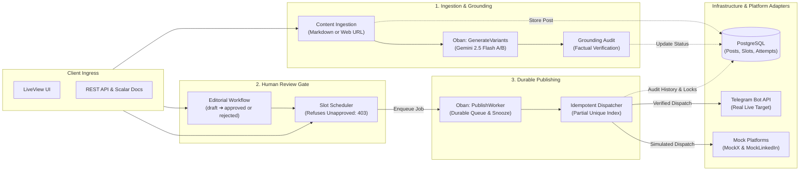

# Social Studio - Multi-Platform Content Ingestion & Publishing Studio

Social Studio is an Elixir/Phoenix API that ingests long-form blog content, generates platform-tailored social media drafts (Telegram, Mock X, Mock LinkedIn), enforces strict constraint rules, provides a human review workflow, and dispatches posts using an idempotent, durable background worker.

---

## Architecture Overview

The application is organized around two Phoenix contexts and asynchronous workers:

- **Content context:** Ingests Markdown or fetched URL content, creates the post and
  local platform drafts, and protects repeat requests with an idempotency key.
- **AI generation and grounding:** An Oban worker calls Gemini, records generation
  usage and cost, and audits generated variants. Grounded output is marked `draft`,
  unsupported claims `rejected`, and audit errors `needs_review`. AI-generated
  variants are returned and broadcast as maps; this worker does not persist them as
  `Variant` rows.
- **Publishing context:** Enforces the review gate for scheduling, creates slots and
  Oban jobs, dispatches through platform adapters, and stores each attempt as an
  audit record. A partial unique index and published-slot short-circuit protect
  dispatch from duplicate claims. Adapter exceptions are recorded as failures so
  the slot can be retried; a concurrent claim is cancelled without a false failure
  notification.
- **LiveView UI:** Provides content ingestion and variant review/publishing flows.
  In the inspector, clicking Publish on a draft is treated as explicit approval;
  rejected and already-published variants are refused.



Detailed sequence diagrams, failure handling, and focused test tags are maintained
in the feature guides:

- [Content ingestion and factual grounding](guides/content_ingestion_and_grounding.md)
- [Publishing, review, scheduling, and dispatch](guides/publishing_and_dispatch.md)

---

## Quick Start (Docker)

### Prerequisites

- Docker Desktop with Docker Compose
- Ports `4000` and `5432` available

### Start the Application

From the repository root, build the Phoenix image and start PostgreSQL and the API:

```bash
docker compose up --build
```

Compose starts the `db` service first and waits for PostgreSQL to become healthy before starting the `web` service. PostgreSQL runs inside Docker; no separate PostgreSQL installation is required on the host. The API will then be available at `http://localhost:4000`.

To start the services in the background:

```bash
docker compose up --build -d
```

Check the service status and follow application logs with:

```bash
docker compose ps
docker compose logs -f web
```

To stop the containers while keeping the PostgreSQL data volume:

```bash
docker compose down
```

To stop the containers and remove the PostgreSQL data volume, useful for a clean database reset:

```bash
docker compose down -v
```

The Compose configuration provides the database URL, Phoenix port, and database migrations automatically. Set `TELEGRAM_BOT_TOKEN` and `TELEGRAM_CHAT_ID` in a `.env` file in the repository root when using the live Telegram adapter.

### Seed Sample Data

To populate the database with a sample blog post, platform variants across lifecycle states (`approved`, `draft`, `published`), a scheduled slot, and audit history:

```bash
mix run priv/repo/seeds.exs
```

When running in Docker, you can also execute the seed script against the database:
```bash
docker compose run --rm web /app/bin/server eval "Code.eval_file(\"/app/lib/flyrank_capstone_social_studio-0.1.0/priv/repo/seeds.exs\")"
```

Once seeded, you can view the campaign in your browser at `http://localhost:4000`, review publishing history at `http://localhost:4000/publishing/history`, and monitor telemetry at `http://localhost:4000/analytics`.

---

## API Endpoints

| Method | Endpoint | Description |
| --- | --- | --- |
| `POST` | `/api/blog-posts` | Ingests a blog post and creates local platform drafts. |
| `PATCH` | `/api/variants/:id` | Updates variant content. |
| `POST` | `/api/variants/:id/approve` | Approves a variant. |
| `POST` | `/api/variants/:id/reject` | Rejects a variant with a reason. |
| `POST` | `/api/variants/:id/schedule` | Schedules an approved variant. |
| `GET` | `/api/campaigns/:id` | Returns a campaign post with variants and slots. |
| `POST` | `/api/slots/:id/publish` | Triggers immediate idempotent dispatch. |
| `GET` | `/api/publishing/history` | Returns the audit trail of publication attempts. |

The focused behavior test commands for each feature are listed in the guides linked above. Interactive OpenAPI documentation is also served via Scalar at `http://localhost:4000/api/scalar`.

---

## Known Limitations

In accordance with the Capstone Brief requirements:
1. **Target Platforms:** Real publication is intentionally implemented for Telegram (via Telegram Bot API) as the free target platform. Platforms without free, non-credit-card bot developer tiers (X / Twitter and LinkedIn) use local mock adapters (`MockX` and `MockLinkedIn`) that simulate exact payload serialization and store previews locally.
2. **AI Provider Rate Limits:** Google Gemini free tier has per-minute request rate limits. If `GEMINI_API_KEY` is omitted or rate-limited, the system falls back gracefully to deterministic local templates without disrupting core ingestion.
3. **Multi-Tenancy:** The current database design is optimized for a single workspace/team per deployment instance; workspace/tenant isolation is defined as a stretch goal.

---

## License

This project is licensed under the MIT License. See the [LICENSE](LICENSE) file for details.