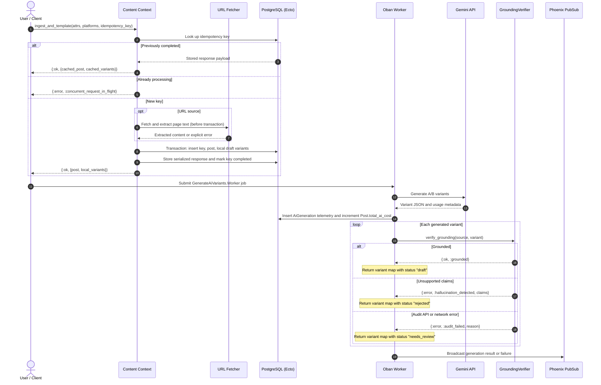

# Content Ingestion & Factual Grounding Architecture

## System Overview

The Flyrank Capstone Social Studio accepts Markdown content or extracts text from a
source URL, creates a post and local platform-specific draft variants, and protects
retries with an idempotency key. AI A/B generation is handled by an Oban worker. Its
core records generation telemetry and checks each generated variant against the
source post before returning the result to the worker.

The current implementation does not expose a `queue_ai_variant_generation/2`
context function. Jobs are submitted through Oban using
`FlyrankCapstoneSocialStudio.Content.GenerateAiVariants.Worker`. The AI-generated
drafts are returned as maps and broadcast to subscribers; unlike the local
ingestion drafts, they are not persisted as `Variant` rows by this pipeline.

## Ingestion to Grounding Sequence



## Failure Recovery & Safety Matrix

| Layer | Failure or edge case | Handling | Result |
| :--- | :--- | :--- | :--- |
| Ingestion | Previously completed idempotency key | Deserialize and return the stored response payload | Same post and local variants are returned |
| Ingestion | Key currently marked as processing | Return the in-flight error | `{:error, :concurrent_request_in_flight}` |
| Ingestion | Concurrent requests race to insert the same key | Database uniqueness conflict is translated to the in-flight error | At most one request creates the post |
| URL extraction | Remote server error or network failure | Return the URL fetcher's explicit error before opening the ingestion transaction | No partial post or local variants are created |
| AI generation | Gemini request returns an HTTP or network error | Return an error from generation; the worker broadcasts failure and Oban receives an error result | Job is eligible for Oban retry, up to the worker's configured maximum of three attempts |
| AI generation | Usage metadata is returned | Insert an `AiGeneration` record and increment `Post.total_ai_cost` before auditing | Telemetry is retained even if an audit then fails |
| Grounding audit | Unsupported claims are found | Mark the returned draft map as `"rejected"` with the unsupported claims in its rejection reason | Human review can identify the unsupported assertions |
| Grounding audit | Audit API/network error | Mark the returned draft map as `"needs_review"` with the audit failure reason | Unverified content is not returned as an approved draft |
| Grounding audit | No API key is configured | Run the offline heuristic, which flags numbers in the variant that are absent from the source | Simple numeric claims are checked locally; this is not a full semantic audit |

## Focused Behavior Tests

The tagged tests exercise the documented paths:

```sh
mix test --only content_ingestion
mix test --only idempotency
mix test --only grounding
mix test --only ai_generation
mix test --only error_handling
```

The `:error_handling` tag is combined with the applicable feature tag, so it can
also be used alongside one of the feature selectors. These tests use Bypass to
exercise HTTP success and failure responses without calling Gemini or external
websites.
