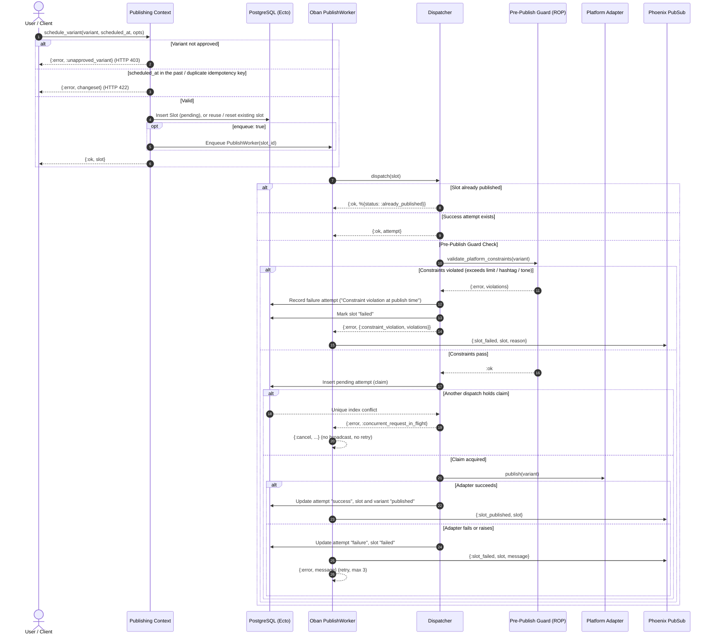

# Publishing: Review, Scheduling & Dispatch

## System Overview

A draft variant becomes a published post in three stages: the **review gate**
(only `approved` variants may be scheduled), **scheduling** (a `Slot` plus an Oban
`PublishWorker` job), and **dispatch** (the `Dispatcher` performs a **pre-publish defense-in-depth constraint check**, claims the slot, calls the platform adapter, and records a `PublishAttempt`). Every attempt is kept as an immutable audit log, readable through `Publishing.list_history/0`.

Double publishing and invalid dispatches are prevented across multiple defense layers:
1. **Pre-Publish Constraint Guard:** Railway-Oriented Programming (ROP) pipeline (`Variant.validate_platform_constraints/2`) validates content against platform profiles before touching the network. Out-of-band edits, rule revisions, or UTM decorator expansions that breach limits are rejected with a recorded failure attempt without worker crashes.
2. **Short-Circuit on Published Slots:** The dispatcher returns immediately if the slot is already marked `published`.
3. **Hardware-Level Idempotency Index:** A PostgreSQL partial unique index (`publish_attempts_active_slot_index`, on `slot_id` where status is `pending` or `success`) guarantees that only one dispatch claim can be acquired at a time under concurrent executions.

---

## Review to Publish Sequence



---

## Failure Recovery & Safety Matrix

| Layer | Failure or edge case | Handling | Result |
| --- | --- | --- | --- |
| Review gate | Draft or rejected variant scheduled | `schedule_variant` refuses | `{:error, :unapproved_variant}`; HTTP 403 |
| Scheduling | `scheduled_at` in the past | `Slot.changeset` validation | `{:error, changeset}` "must be in the future"; HTTP 422 |
| Scheduling | Duplicate idempotency key | Unique constraint | `{:error, changeset}` "has already been taken" |
| Scheduling | Variant already has a slot | Row lock, existing slot returned | No duplicate slot or job |
| Scheduling | Failed slot rescheduled | Reset to `pending` and re-enqueued | Slot retried |
| Scheduling | Instant mode (`enqueue: false`) | No Oban job | Dispatched inline |
| Pre-Publish Guard | Content exceeds platform length | ROP checks `Variant.validate_platform_constraints/2` | Fails before network; attempt recorded as `failure`, slot `failed` |
| Pre-Publish Guard | Hashtag quota breached at publish | ROP checks `ConstraintProfile.max_hashtags` | Halts before API call; `{:error, {:constraint_violation, [:too_many_hashtags]}}` |
| Dispatch | Slot already published | Short-circuit | `{:ok, %{status: :already_published}}` |
| Dispatch | Success attempt already recorded | Return it | `{:ok, attempt}`, adapter not called |
| Dispatch | Concurrent dispatch of the same slot | Partial unique index on the pending claim | One publishes, the other gets `{:error, :concurrent_request_in_flight}` |
| Adapter | Adapter raises or throws | Dispatcher rescues it and resolves claim | Attempt `failure` ("Adapter exception: ..."), slot `failed`, retryable |
| Adapter | Adapter returns an error | Attempt `failure`, slot `failed` | `{:error, attempt}` |
| Adapter (Telegram) | Text > 4,096 chars | Adapter ROP ceiling check (`@max_telegram_characters 4096`) | `{:error, "Content exceeds Telegram 4096 character limit"}` without HTTP request |
| Adapter (Telegram) | Telegram credentials missing | Explicit check in `resolve_credentials/1` | Error string, slot `failed` |
| Adapter (Telegram) | Markdown parsing issues | Uses `parse_mode: "HTML"` by default | Eliminates `400 Bad Request: can't parse entities` caused by unescaped Markdown symbols |
| Adapter (Telegram) | Rate limited (HTTP 429) | Parses `retry-after` header and `body.parameters.retry_after` | Returns `{:error, {:rate_limited, seconds}}` |
| Worker | Rate limit encountered | Oban catches `{:rate_limited, seconds}` | Calls `{:snooze, seconds}` to sleep dynamically without wasting retry budget |
| Worker | Concurrent claim | Job cancelled silently | `{:cancel, :concurrent_request_in_flight}`; no `:slot_failed`, no retry |
| Worker | Dispatch error | Broadcast `:slot_failed` and return `{:error, msg}` | Oban retries, up to 3 attempts |
| Worker | Oban restarts a finished job | Dispatcher short-circuit | No duplicate attempt |
| UI | Instant publish succeeds | Flash info | "Successfully published to MOCK_X" |
| UI | Scheduled publish | Flash info | "Post scheduled for Jan 01, 2099 at 10:30 UTC" |
| UI | Unparseable time | Falls back to now | No crash |
| UI | Adapter failure | Flash error | "Dispatch failed", slot `failed` |
| UI | Needs review or rejected variant | Refused before any slot is created | Flash error "Cannot publish a variant under review or rejected. Review or edit it first." |
| UI | Save edits on variant | Resets `needs_review` or `rejected` to `draft` | Editor can re-verify grounding or publish explicitly |
| UI | Verify grounding button | Triggers async `VerifyGroundingWorker` | Real-time spinner until factual audit completes |
| UI | Scheduling error | Flash error | "Publishing failed" |

---

## Design Notes

- **Railway-Oriented Pre-Publish Guard:** Dispatches run through `Variant.validate_platform_constraints/2` right before touching the network. This defense-in-depth step catches out-of-band updates, dynamic UTM expansions, and configuration changes before hitting external APIs.
- **Telegram Platform Alignment:**
  - Uses `max_length: 4096` matching Telegram's UTF-8 message limit for `sendMessage`.
  - Configured with `parse_mode: "HTML"` to avoid fragile entity parsing errors common with `MarkdownV2`.
  - Enforces length validation directly inside `Adapters.Telegram.publish/2` before transmitting HTTP requests.
- **Human-in-the-Loop Review Gate:** A draft published from the inspector counts as the reviewer's explicit approval and is approved on the fly. Variants in `needs_review`, `rejected`, or `published` state are refused.
- **Editorial Remediation:** Saving edits on any `needs_review` or `rejected` variant automatically transitions it back to `draft`, enabling human re-evaluation before approval.
- **Pluggable Adapter Seam:** The dispatcher resolves adapter modules dynamically from application configuration (`Publishing.adapter_for_platform/1`), allowing seamless swapping between real adapters and local mocks (`MockX`, `MockLinkedIn`).
- **Dynamic Snooze on Rate Limits:** When an adapter returns an HTTP 429 rate limit with a `Retry-After` header, the worker returns `{:snooze, seconds}` to sleep dynamically rather than burning retry attempts.
- **Publishing History & Diagnostics UI:** Mounted at `/publishing/history` (`PublishingHistoryLive`), providing real-time streaming of all dispatch attempts. Clicking "Inspect" opens a diagnostic drawer/modal revealing the adapter name, exact attempt timestamp, slot idempotency key, external post ID, raw adapter JSON payloads, and pre-publish guard violation details.

---

## Focused Behavior Tests & Verified Transcripts

Run the behavior tests matching the test suites:

```bash
# Publishing and pre-publish defense-in-depth dispatch tests
mix test test/flyrank_capstone_social_studio/publishing_test.exs

# Adapter seam, mock adapters, and Telegram HTTP / rate-limit tests
mix test test/flyrank_capstone_social_studio/adapter_test.exs

# Publishing History LiveView UI tests (rendering, modal inspection, PubSub streaming)
mix test test/flyrank_capstone_social_studio_web/live/publishing_history_live_test.exs

# Content ingestion and constraint profile tests
mix test test/flyrank_capstone_social_studio/content_test.exs
```
