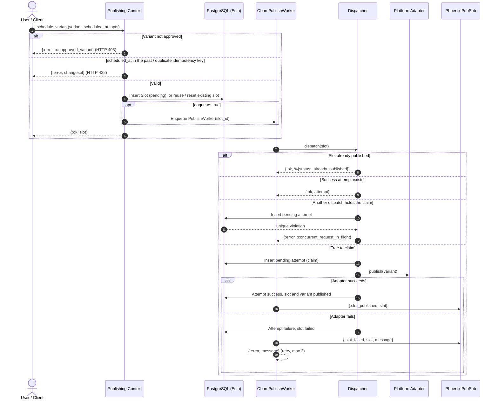

# Publishing: Review, Scheduling & Dispatch

## System Overview

A draft variant becomes a published post in three stages: the **review gate**
(only `approved` variants may be scheduled), **scheduling** (a `Slot` plus an Oban
`PublishWorker` job), and **dispatch** (the `Dispatcher` claims the slot, calls the
platform adapter, and records a `PublishAttempt`). Every attempt is kept as an audit
log, readable through `Publishing.list_history/1`.

Double publishing is prevented in two layers: the dispatcher short-circuits on
already-published slots, and a partial unique index
(`publish_attempts_active_slot_index`, on `slot_id` where status is `pending` or
`success`) lets only one dispatch claim a slot at a time.

## Review to Publish Sequence



## Failure Recovery & Safety Matrix

| Layer | Failure or edge case | Handling | Result |
| --- | --- | --- | --- |
| Review gate | Draft or rejected variant scheduled | `schedule_variant` refuses | `{:error, :unapproved_variant}`; HTTP 403 |
| Scheduling | `scheduled_at` in the past | `Slot.changeset` validation | `{:error, changeset}` "must be in the future"; HTTP 422 |
| Scheduling | Duplicate idempotency key | Unique constraint | `{:error, changeset}` "has already been taken" |
| Scheduling | Variant already has a slot | Row lock, existing slot returned | No duplicate slot or job |
| Scheduling | Failed slot rescheduled | Reset to `pending` and re-enqueued | Slot retried |
| Scheduling | Instant mode (`enqueue: false`) | No Oban job | Dispatched inline |
| Dispatch | Slot already published | Short-circuit | `{:ok, %{status: :already_published}}` |
| Dispatch | Success attempt already recorded | Return it | `{:ok, attempt}`, adapter not called |
| Dispatch | Concurrent dispatch of the same slot | Partial unique index on the pending claim | One publishes, the other gets `{:error, :concurrent_request_in_flight}` |
| Adapter | Adapter returns an error | Attempt `failure`, slot `failed` | `{:error, attempt}` |
| Adapter | Telegram credentials missing | Explicit error from the adapter | Error string, slot `failed` |
| Worker | Dispatch error | Broadcast `:slot_failed` and return `{:error, msg}` | Oban retries, up to 3 attempts |
| Worker | Oban restarts a finished job | Dispatcher short-circuit | No duplicate attempt |
| UI | Instant publish succeeds | Flash info | "Successfully published to MOCK_X" |
| UI | Scheduled publish | Flash info | "Post scheduled for Jan 01, 2099 at 10:30 UTC" |
| UI | Unparseable time | Falls back to now | No crash |
| UI | Adapter failure | Flash error | "Dispatch failed", slot `failed` |
| UI | Scheduling error | Flash error | "Publishing failed" |

## Known Limitations

- If an adapter raises (instead of returning an error), the attempt stays `pending`
  and the active-slot index blocks retries until it is cleaned up.
- `PublishWorker` reports `:concurrent_request_in_flight` like any other error and
  broadcasts `:slot_failed`.
- `PublishAction.ensure_approved` approves any non-approved variant, so the inspector
  publish path bypasses the review gate.
- The Telegram adapter URL is fixed, so only its missing-credentials path is tested.

## Focused Behavior Tests

Run the behavior tests by tag:

```bash
mix test --only publishing        # everything in this guide
mix test --only review_gate       # approval gate and HTTP 403
mix test --only scheduling        # slots, jobs, auto spacing, past times
mix test --only dispatch          # idempotency, claims, concurrency
mix test --only publish_worker    # Oban worker and PubSub broadcasts
mix test --only publish_history   # audit log
mix test --only adapters          # adapter seam and mock adapters
mix test --only publish_ui        # inspector publish modal
mix test --only error_handling    # failure paths only
```
