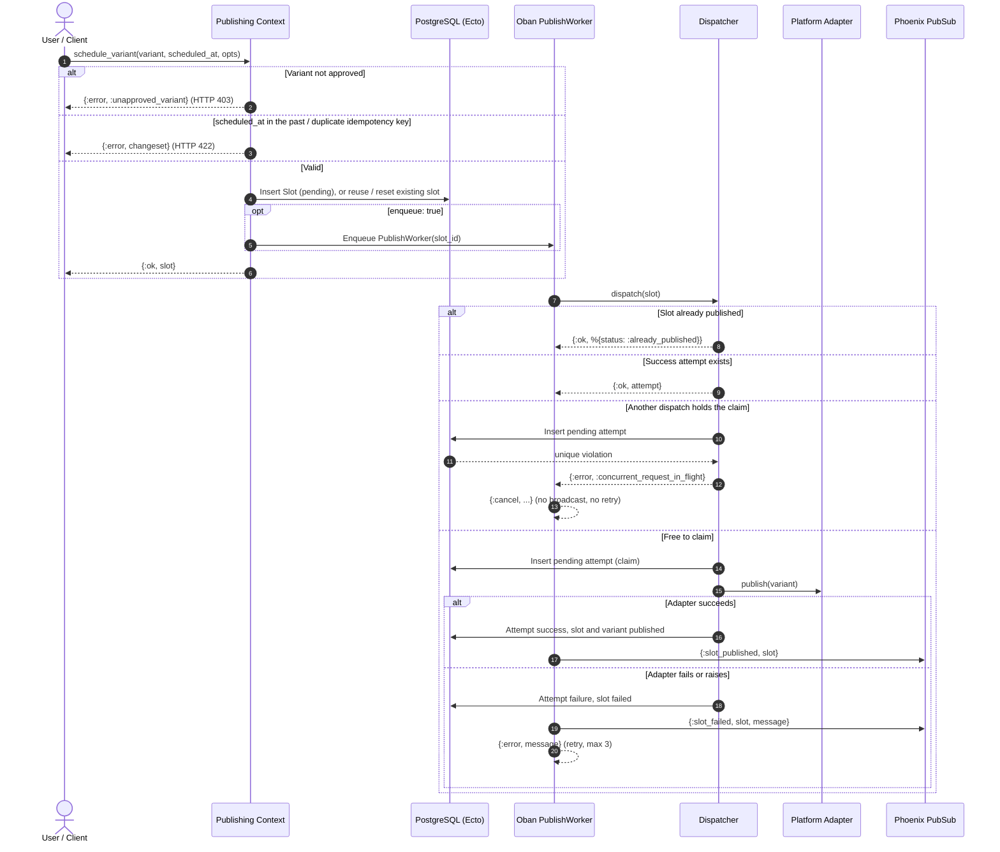

# Publishing: Review, Scheduling & Dispatch

## System Overview

A draft variant becomes a published post in three stages: the **review gate**
(only `approved` variants may be scheduled), **scheduling** (a `Slot` plus an Oban
`PublishWorker` job), and **dispatch** (the `Dispatcher` claims the slot, calls the
platform adapter, and records a `PublishAttempt`). Every attempt is kept as an audit
log, readable through `Publishing.list_history/1`.

Double publishing is prevented in two layers: the dispatcher short-circuits on
already-published slots, and a partial unique index
(`publish_attempts_active_slot_index`, on `slot_id` where status is `pending` or
`success`) lets only one dispatch claim a slot at a time.

## Review to Publish Sequence



## Failure Recovery & Safety Matrix

| Layer | Failure or edge case | Handling | Result |
| --- | --- | --- | --- |
| Review gate | Draft or rejected variant scheduled | `schedule_variant` refuses | `{:error, :unapproved_variant}`; HTTP 403 |
| Scheduling | `scheduled_at` in the past | `Slot.changeset` validation | `{:error, changeset}` "must be in the future"; HTTP 422 |
| Scheduling | Duplicate idempotency key | Unique constraint | `{:error, changeset}` "has already been taken" |
| Scheduling | Variant already has a slot | Row lock, existing slot returned | No duplicate slot or job |
| Scheduling | Failed slot rescheduled | Reset to `pending` and re-enqueued | Slot retried |
| Scheduling | Instant mode (`enqueue: false`) | No Oban job | Dispatched inline |
| Dispatch | Slot already published | Short-circuit | `{:ok, %{status: :already_published}}` |
| Dispatch | Success attempt already recorded | Return it | `{:ok, attempt}`, adapter not called |
| Dispatch | Concurrent dispatch of the same slot | Partial unique index on the pending claim | One publishes, the other gets `{:error, :concurrent_request_in_flight}` |
| Adapter | Adapter raises or throws | Dispatcher rescues it and resolves the claim | Attempt `failure` ("Adapter exception: ..."), slot `failed`, retryable |
| Adapter | Adapter returns an error | Attempt `failure`, slot `failed` | `{:error, attempt}` |
| Adapter | Telegram credentials missing | Explicit error from the adapter | Error string, slot `failed` |
| Worker | Concurrent claim | Job cancelled silently | `{:cancel, :concurrent_request_in_flight}`; no `:slot_failed`, no retry |
| Worker | Dispatch error | Broadcast `:slot_failed` and return `{:error, msg}` | Oban retries, up to 3 attempts |
| Worker | Oban restarts a finished job | Dispatcher short-circuit | No duplicate attempt |
| UI | Instant publish succeeds | Flash info | "Successfully published to MOCK_X" |
| UI | Scheduled publish | Flash info | "Post scheduled for Jan 01, 2099 at 10:30 UTC" |
| UI | Unparseable time | Falls back to now | No crash |
| UI | Adapter failure | Flash error | "Dispatch failed", slot `failed` |
| UI | Needs review or rejected variant | Refused before any slot is created | Flash error "Cannot publish a variant under review or rejected. Review or edit it first." |
| UI | Save edits on variant | Resets `needs_review` or `rejected` to `draft` | Editor can re-verify grounding or publish explicitly |
| UI | Verify grounding button | Triggers async `VerifyGroundingWorker` | Real-time spinner until factual audit completes |
| UI | Scheduling error | Flash error | "Publishing failed" |

## Design Notes

- A draft published from the inspector counts as the reviewer's explicit approval and is
  approved on the fly. Variants in `needs_review`, `rejected`, or `published` state are refused.
- Saving edits on any `needs_review` or `rejected` variant automatically transitions it to `draft`, enabling human-in-the-loop remediation before publishing.
- The Telegram base URL comes from `config :flyrank_capstone_social_studio, :telegram_base_url` (default `https://api.telegram.org`), allowing tests to intercept calls via Bypass.
- Oban owns retries and backoff. When an adapter returns an HTTP 429 rate limit with a `Retry-After` header, the worker parses the duration and returns `{:snooze, seconds}` to sleep dynamically.
- The partial unique index on `publish_attempts (slot_id) WHERE status = 'success'` guarantees hardware-level idempotency under race conditions.

## Focused Behavior Tests & Verified Transcripts

Run the behavior tests by tag matching the proofs in `EVIDENCE.md`:

```bash
mix test --only publishing        # full publishing suite (30+ tests)
mix test --only review_gate       # approval gate and HTTP 403 (4/4 passed)
mix test --only scheduling        # slots, jobs, auto spacing, past times (6/6 passed)
mix test --only dispatch          # idempotency, claims, concurrency (7/7 passed)
mix test --only publish_worker    # Oban worker, retries, snoozing, and PubSub (6/6 passed)
mix test --only publish_history   # permanent audit log and error tracking (2/2 passed)
mix test --only adapters          # adapter seam, mock adapters, Telegram via Bypass (12/12 passed)
mix test --only publish_ui        # inspector publish modal and status gates
mix test --only error_handling    # failure paths and timeout rescues
```

### Clean ExUnit Test Transcripts

#### 1. Review Gate (`:review_gate`)
```text
mix test --only review_gate
Running ExUnit with seed: 857547, max_cases: 24
....
Finished in 0.4 seconds (0.3s async, 0.1s sync)
Result: 4 passed, 65 excluded
```

#### 2. Idempotent Dispatch (`:dispatch`)
```text
mix test --only dispatch
Running ExUnit with seed: 600220, max_cases: 24
.......
Finished in 0.7 seconds (0.3s async, 0.4s sync)
Result: 7 passed, 62 excluded
```

#### 3. Durable Worker & Rate-Limit Snooze (`:publish_worker`)
```text
mix test --only publish_worker
Running ExUnit with seed: 436833, max_cases: 24
......
Finished in 0.6 seconds (0.3s async, 0.3s sync)
Result: 6 passed, 65 excluded
```

#### 4. Platform Adapters Seam (`:adapters`)
```text
mix test --only adapters
Running ExUnit with seed: 153099, max_cases: 24
............
Finished in 0.8 seconds (0.4s async, 0.4s sync)
Result: 12 passed, 57 excluded
```
